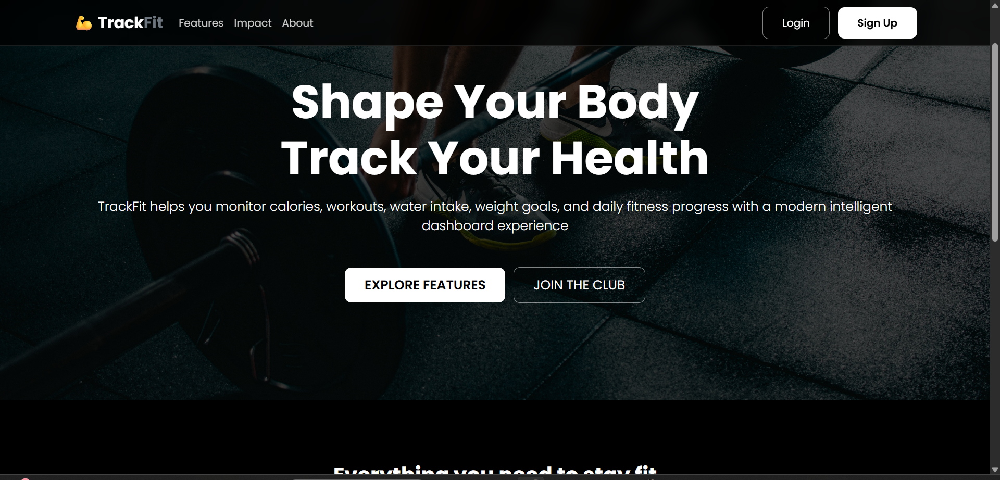
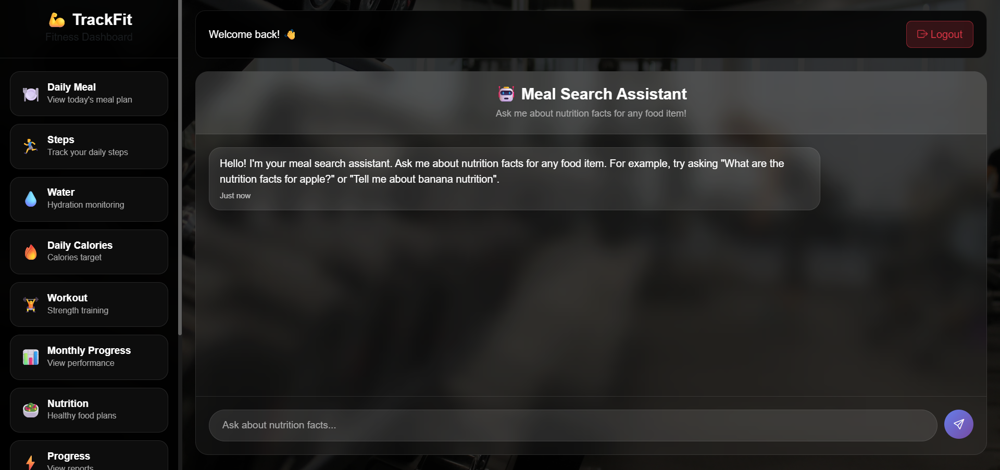
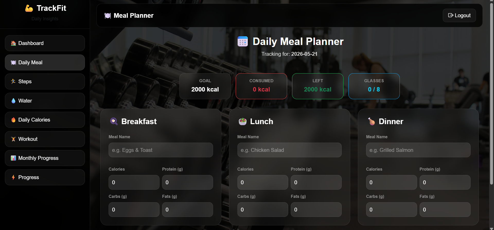
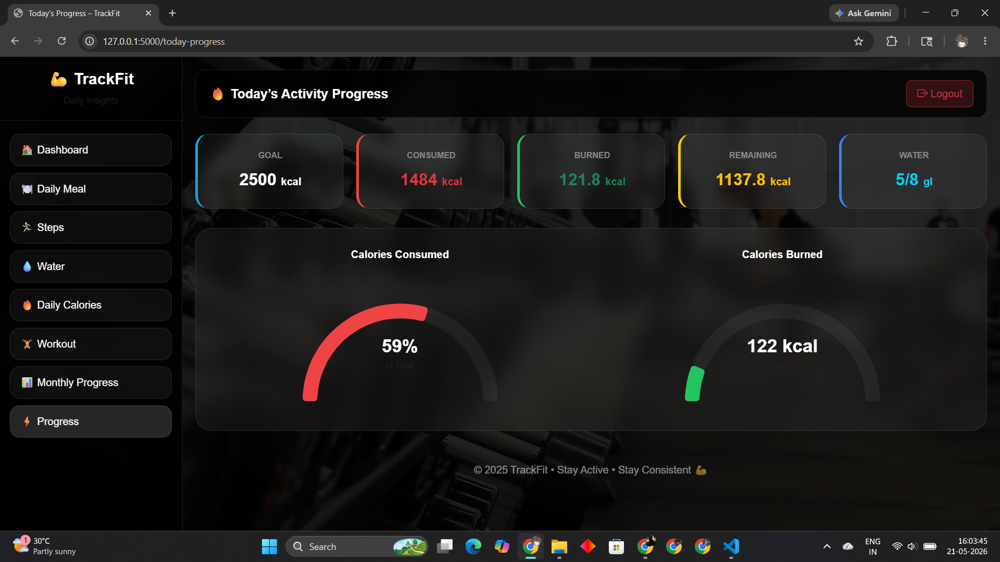
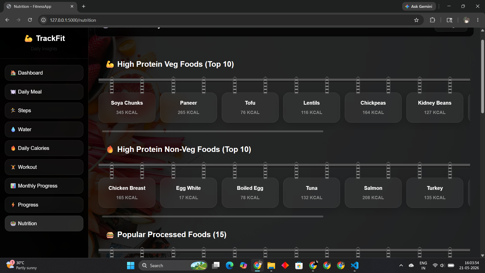

# 🏋️ Track Fit
Track Fit is a modern Fitness & Calorie Tracking Web Application built using Flask, MongoDB, HTML, CSS, and JavaScript.

The application helps users track:
- Daily Meals
- Calories
- Water Intake
- Steps
- Workouts
- Monthly Progress
- Nutrition Information

# 📸 Project Preview

## Add Project Screenshot Here




---

# 🚀 Features

## 🔐 User Authentication
- User Signup
- Login System
- Password Hashing Security
- Session Management

---

## 🍽 Meal Tracking
- Breakfast, Lunch, Dinner Tracking
- Nutrition Information
- Calories Counter
- Protein, Carbs, Fat Tracking

---

## 🥗 Nutrition Search
- Smart Nutrition Search
- Food Calories Information
- AI Nutrition Support
- Common Indian Food Database

---

## 🏃 Step Tracking
- Daily Step Counter
- Distance Calculation
- Calories Burned Tracking

---

## 💧 Water Tracker
- Daily Water Goal
- Water Intake Progress
- Add/Remove Water Glasses

---

## 🏋️ Workout Management
- Daily Workout Plans
- Exercise Calories
- Workout Save System

---

## 📊 Progress Dashboard
- Daily Progress
- Monthly Progress Analytics
- Calories Graph
- Water Progress

---

# 🛠️ Technologies Used

## Frontend
- HTML
- CSS
- JavaScript
- Bootstrap

## Backend
- Python Flask

## Database
- MongoDB

## Libraries
- PyMongo
- APScheduler
- Werkzeug
- OpenAI API

---

# 📂 Project Structure

```bash
Track-Fit/
│
├── static/
│   ├── css/
│   ├── js/
│   ├── images/
│
├── templates/
│
├── app.py
├── requirements.txt
├── README.md
```

---

# ⚙️ Installation

## 1️⃣ Clone Repository

```bash
git clone https://github.com/darshanvh/Track-Fit.git
```

---

## 2️⃣ Open Project

```bash
cd Track-Fit
```

---

## 3️⃣ Install Requirements

```bash
pip install -r requirements.txt
```

---

## 4️⃣ Start MongoDB

Make sure MongoDB is running locally.

```bash
mongodb://localhost:27017/
```

---

## 5️⃣ Run Application

```bash
python app.py
```

---

# 🌐 Open In Browser

```bash
http://127.0.0.1:5000
```

---

# 📸 Add Screenshot Section

## Homepage



---

## Dashboard



---

## Calories Page



---

## Nutrition Page




---

# 🔥 Future Improvements

- BMI Calculator
- AI Fitness Chatbot
- Live Workout Videos
- Mobile Responsive UI
- Dark Mode
- Fitness Goals
- Smart Recommendations

---

# 👨‍💻 Developer

## Darshan Hegde

MCA Student | Full Stack Developer | Fitness Web App Developer

GitHub:
https://github.com/darshanvh

---

# ⭐ Support

If you like this project:

⭐ Star the repository  
🍴 Fork the project  
📢 Share with others

---

# 📄 License

This project is for educational purposes.
